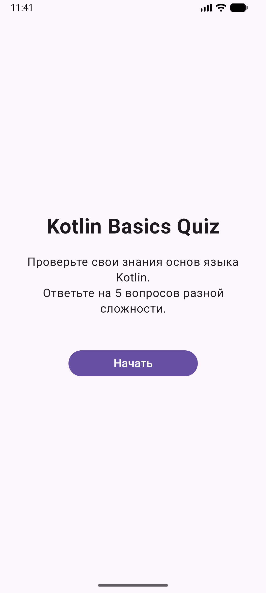
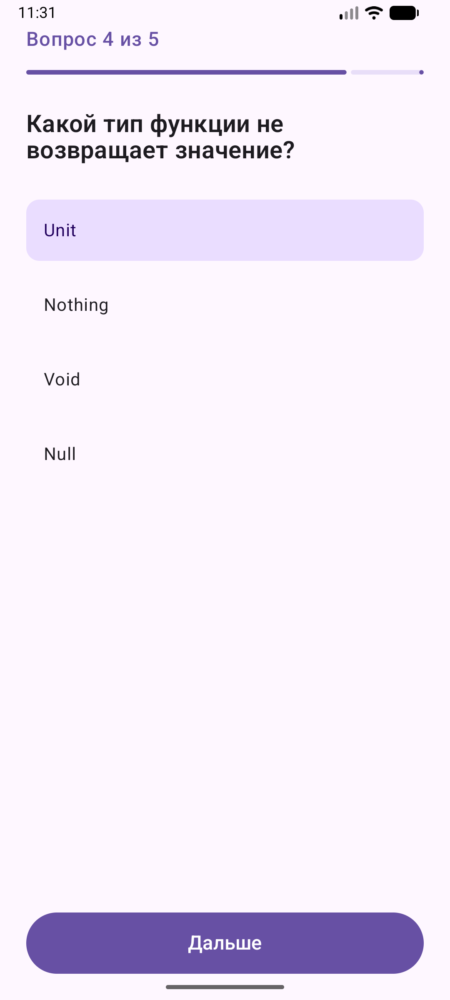
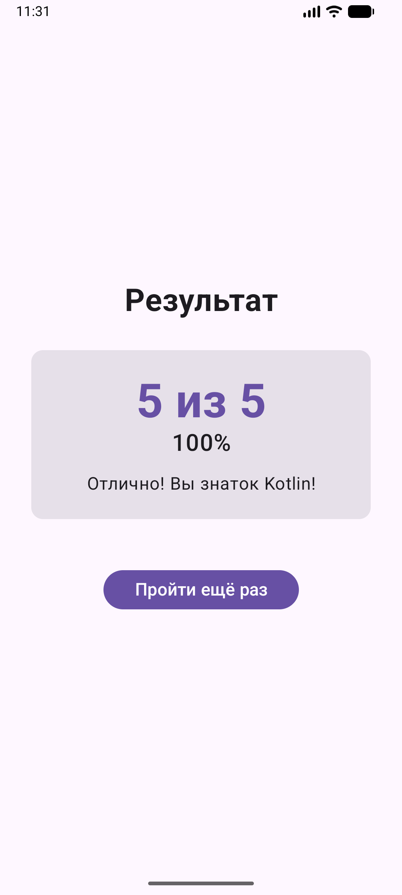

# Quiz Trainer - Kotlin Basics Quiz

- **ФИО:** Лисицына Алёна Алексеевна
- **Группа:** Б9123-09.03.03 ПИКД (1 подгруппа)

## Тема квиза
**Quiz Trainer** - викторина по основам языка Kotlin

## Функционал приложения
1. **Стартовый экран** - приветствие и описание квиза
2. **Экран вопроса** - отображение вопроса, вариантов ответов, прогресс-бар
3. **Экран результатов** - итоговый счет, процент правильных ответов, комментарий
4. **Логика викторины**:
    - 5 вопросов по Kotlin
    - Выбор одного ответа из четырех
    - Подсчет правильных ответов
    - Возможность пройти заново

## Скриншоты
### Экран приветствия

### Экран вопроса

### Экран результатов

