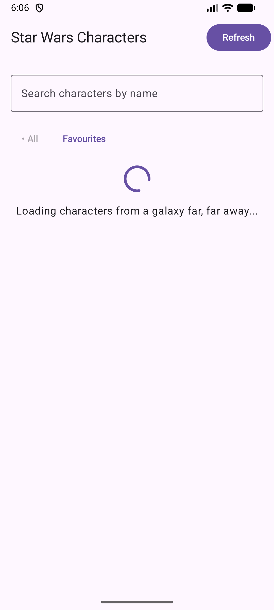
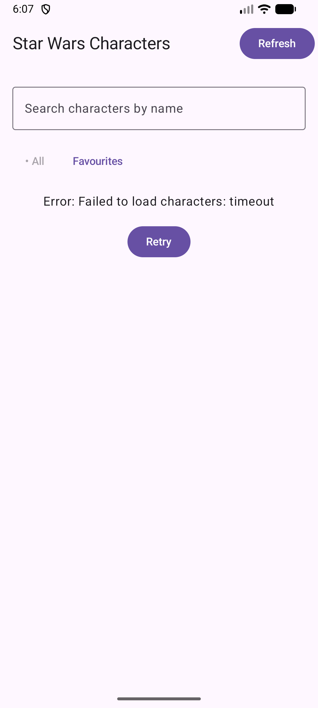
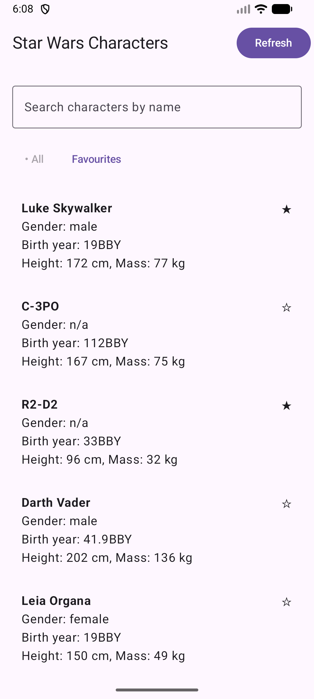
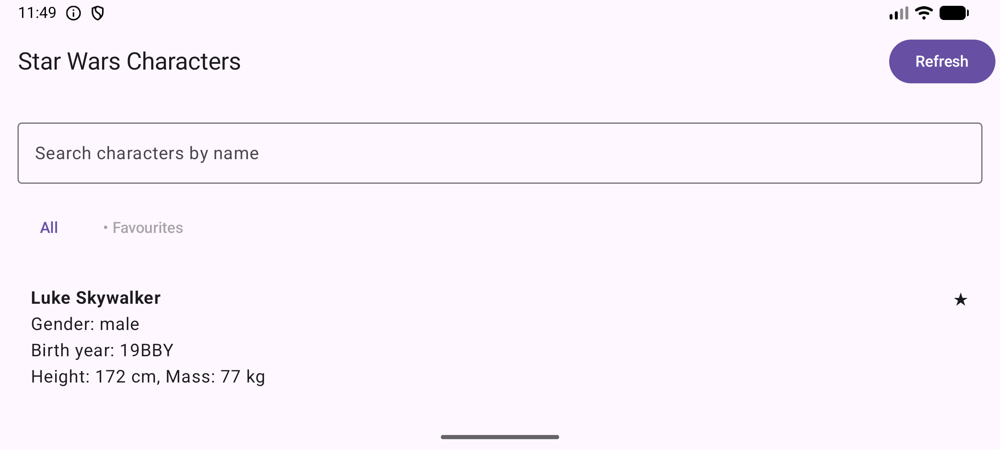
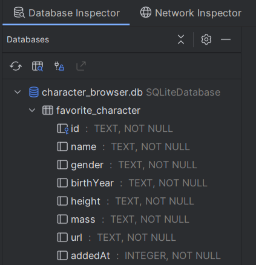

# Приложение на любом открытом API

- **ФИО:** Лисицына Алёна Алексеевна
- **Группа:** Б9123-09.03.03 ПИКД (1 подгруппа)
- **API: SWAPI** (Star Wars API) - информация о персонажах Star Wars
- **Как запустить:** просто собрать проект, API бесплатный без ключа
- CharactersApp.kt больше не используется
- Хотелось бы оценку 5, но сомневаюсь, что дотяну, поэтому стремлюсь к 4

# Что храним в Room
- **Таблица:** favorite_character
- **Сущность:** FavoriteCharacterEntity

- **Поля и их назначения:**
  - id - Уникальный идентификатор персонажа
  - name - Имя персонажа
  - gender - Пол
  - birthYear - Год рождения
  - height - Рост
  - mass - Вес
  - url - Ссылка на полную информацию в API
  - addedAt - Временная метка добавления в избранное

- **Сценарий:** Избранное (Favourites). Пользователь может добавлять
персонажей в избранное. 
Список избранных сохраняется в локальную базу данных Room
и не теряется после перезапуска приложения.

# Как проверить работу Room
- Запустить приложение.
- В списке персонажей нажать на звёздочку у любого персонажа для добавление в избранное.
- Закрыть приложение.
- Снова открыть приложение.
- Переключиться на Favourites — персонаж останется в списке избранных.

## Скриншоты
### Экран загрузки

### Экран ошибки

### Экран со списком

### Экран с деталями

### Экран любимых

### Состояние Room
