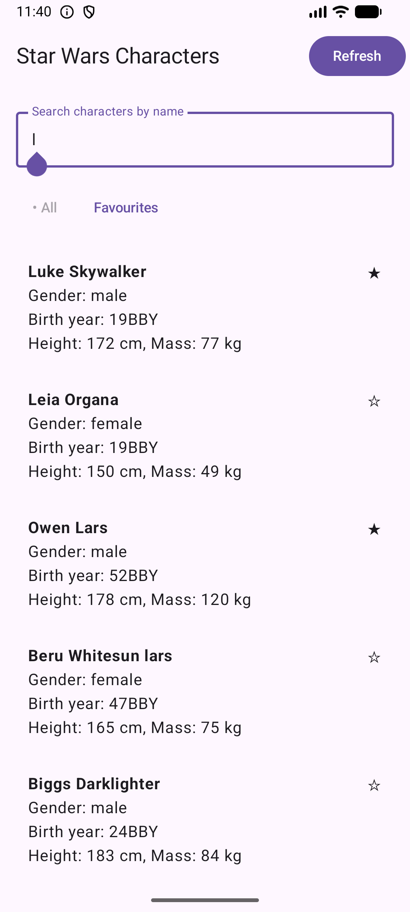
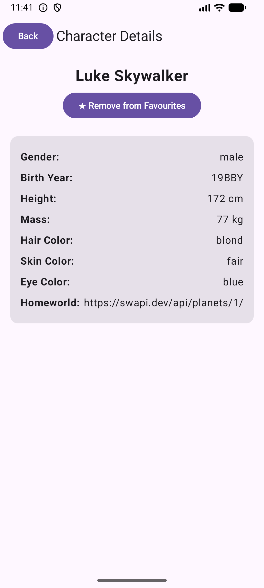

# Приложение на любом открытом API

- **ФИО:** Лисицына Алёна Алексеевна
- **Группа:** Б9123-09.03.03 ПИКД (1 подгруппа)
- **API:** SWAPI (Star Wars API) - информация о персонажах Star Wars
- **Как запустить:** просто собрать проект, API бесплатный без ключа

## Скриншоты
### Экран поиска

### Экран любимых

### Экран любимых перевёрнутый

### Экран персонажа

## Чеклист
### Обязательное
- Навигация (2 экрана)
- Архитектура (MVVM с Repository)
- Coroutines + Retrofit
- UI состояния (Loading, Error, Empty, Success)
- Избранное (локальное хранение)
- Compose + Material3
- Navigation Compose
- ViewModel + viewModelScope

### Бонусы
- Debounce поиска (Job + delay)
- Логирование запросов (OkHttp logging)
- Кнопка Refresh